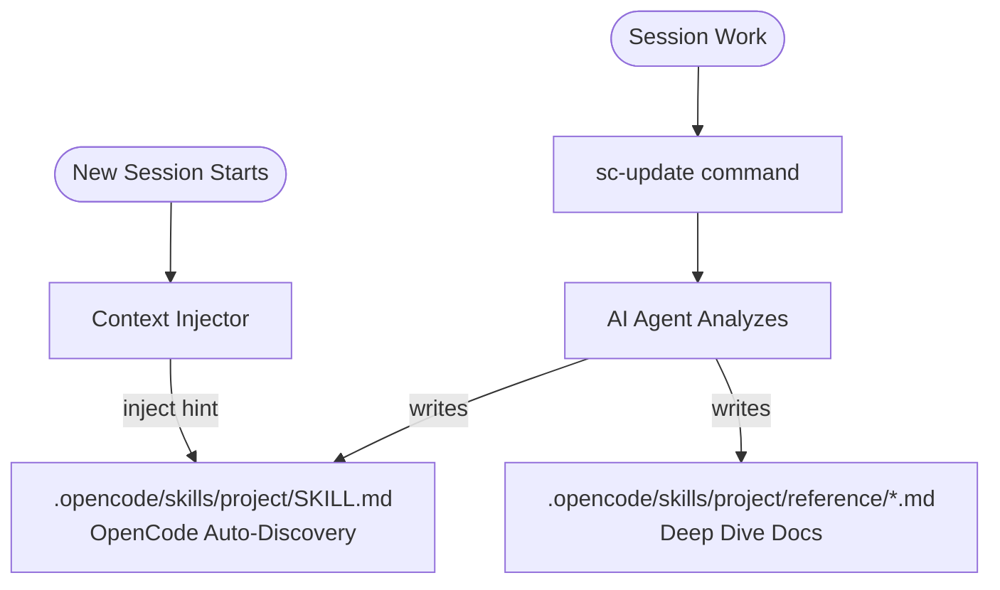

# Smart-Codebase

[English](README.md) | [简体中文](README.zh-cn.md)

> **Turn your OpenCode into a senior project expert that learns and grows with every task.**

---

## 🔥 The Pain Point

Every time you start a new session, AI starts from scratch. It doesn't remember:
- Why you chose that architecture?
- What gotchas exist in your codebase?
- What patterns your team follows?
- What you learned from debugging that nasty bug?

**You explain the same things over and over.**

## ✨ The Solution

Smart-Codebase gives your AI permanent memory through SKILL files. It uses an AI agent to autonomously capture knowledge from your conversations and project files.



---

## 📖 Table of Contents

- [⚙️ How It Works](#️-how-it-works)
- [📦 Installation](#-installation)
- [⚡ Commands](#-commands)
- [⚙️ Configuration](#️-configuration)
- [📁 File Structure](#-file-structure)
- [🛠️ Development](#️-development)

---

## ⚙️ How It Works

1. **You work normally** - Edit files, debug issues, and make architectural decisions.
2. **Manual capture** - When you reach a milestone, run `/sc-update`.
3. **AI Agent analyzes** - A child AI session examines your conversation and code to understand what changed and why.
4. **Knowledge distilled** - The agent autonomously writes or updates SKILL files in standard OpenCode format.
5. **Next session starts** - New sessions auto-discover your project SKILLs, giving the AI immediate context.

**Manual control means you decide exactly when to preserve knowledge. The AI agent handles the heavy lifting of writing documentation.**

---

## 📦 Installation

Navigate to your `~/.config/opencode` directory:

```bash
# Using bun
bun add smart-codebase

# Or using npm
npm install smart-codebase
```

Add to your `opencode.json`:

```json
{
  "plugin": ["smart-codebase"]
}
```

---

## ⚡ Commands

| Command | Description |
|---------|-------------|
| `/sc-update [focus?]` | Trigger the AI agent to extract knowledge. Use optional focus to guide the agent. |

---

## ⚙️ Configuration

Create `~/.config/opencode/smart-codebase.json` (or `.jsonc`) to customize:

```jsonc
{
  "enabled": true,
  "extractionModel": "openai/gpt-4o",
  "extractionMaxTokens": 16000
}
```

| Option | Default | Description |
|--------|---------|-------------|
| `enabled` | `true` | Enable or disable the plugin entirely. |
| `extractionModel` | - | Model for the AI agent (e.g., `providerID/modelID`). |
| `extractionMaxTokens` | `16000` | Token budget for the extraction context. |

---

## 📁 File Structure

Knowledge is stored in your project directory using the standard OpenCode SKILL format:

```
project/
└── .opencode/
    └── skills/
        └── <project-name>/
            ├── SKILL.md          # Main project skill and index
            └── reference/        # Detailed documentation files
                ├── architecture.md
                └── api-patterns.md
```

---

## 🛠️ Development

```bash
# Install dependencies
bun install

# Build the plugin
bun run build

# Run type checks
bun run typecheck

# Run tests
bun test
```

---

## 📄 License

[Apache-2.0](LICENSE)
