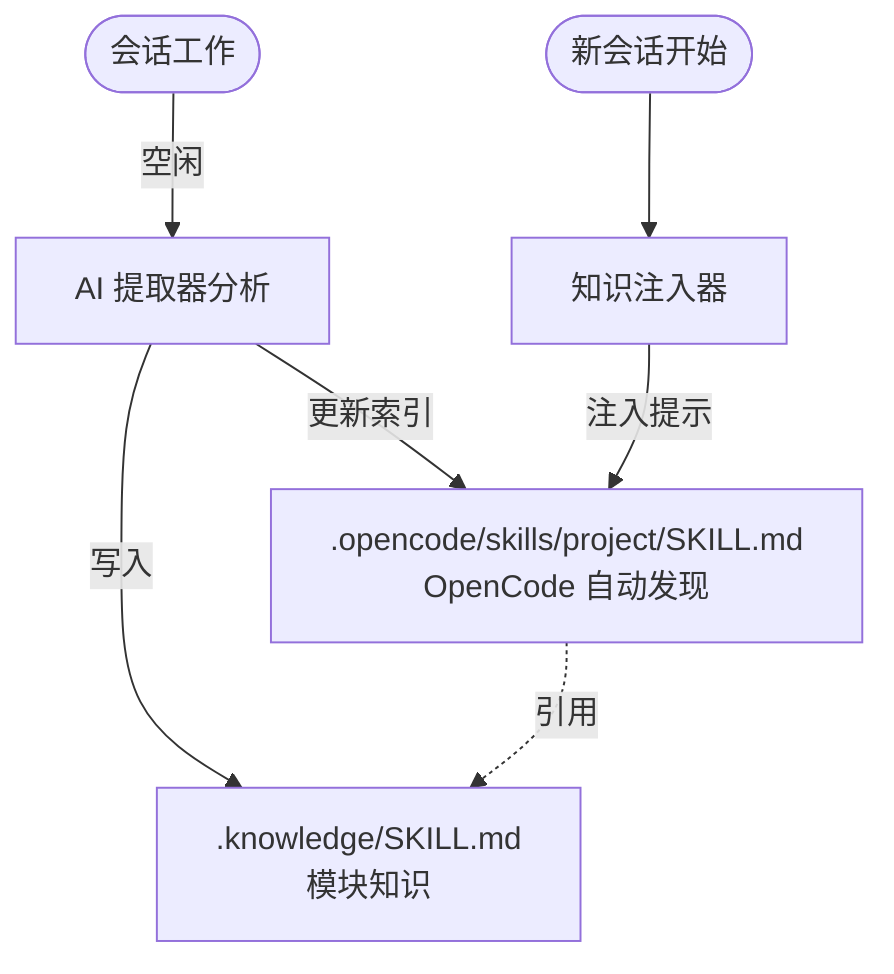

# Smart-Codebase

[English](README.md) | [简体中文](README.zh-cn.md)

> **让你的 OpenCode 在完成任务时，不断学习成长，变成你独一无二的资深项目专家。**

---

## 🔥 你的痛点

每次开始新会话时，AI 都从零开始。它不记得：
- 你为什么选择那个架构？
- 代码库中存在哪些坑？
- 你的团队遵循什么模式？
- 你从调试那个棘手的 bug 中学到了什么？

**你一遍又一遍地解释同样的事情。**

## ✨ 解决方案

smart-codebase 自动从会话中捕获知识，并使其可供未来会话使用。



---

## 📖 目录

- [⚙️ 工作原理](#️-工作原理)
- [📦 安装](#-安装)
- [⚡ 命令](#-命令)
- [⚙️ 配置](#️-配置)
- [📁 文件结构](#-文件结构)
- [📊 使用统计](#-使用统计)
- [🧹 清理命令](#-清理命令)
- [🛠️ 开发](#️-开发)

---

## ⚙️ 工作原理

1. **你正常工作** - 编辑文件、调试问题、做决策
2. **会话空闲** - 60 秒无活动后，出现 toast 通知
3. **你可以打断** - 发送消息即可取消提取并继续工作
4. **提取器分析** - AI 检查发生了什么变化以及为什么（带进度通知）
5. **知识被捕获** - 存储在 `.opencode/skills/<项目>/modules/<模块>.md` 中
6. **索引更新** - 全局索引位于 `.opencode/skills/<项目>/SKILL.md`
7. **下次会话开始** - AI 读取项目 skill，然后发现相关模块 skill

**插件在后台静默工作。Toast 通知让你知情，而不打断你的工作流。**

---

## 📦 安装

进入 `~/.config/opencode` 目录：

```bash
# 使用 bun
bun add smart-codebase

# 或使用 npm
npm install smart-codebase
```

添加到你的 `opencode.json`：

```json
{
  "plugin": ["smart-codebase"]
}
```

---

## ⚡ 命令

| 命令 | 描述 |
|------|------|
| `/sc-status` | 显示知识库状态和使用统计 |
| `/sc-extract` | 手动触发知识沉淀 |
| `/sc-rebuild-index` | 从所有 SKILL.md 文件重建 `.knowledge/KNOWLEDGE.md` |
| `/sc-cleanup` | 清理低使用率 SKILL 文件（预览模式） |
| `/sc-cleanup --confirm` | 实际删除低使用率 SKILL 文件 |

---

## ⚙️ 配置

默认无须配置，如需改变默认配置，创建 `~/.config/opencode/smart-codebase.json`（或 `.jsonc`）：

```jsonc
{
  "enabled": true,
  "debounceMs": 30000,
  "autoExtract": true,
  "autoInject": true,
  "extractionModel": "minimax/MiniMax-M2.1",
  "disabledCommands": ["sc-rebuild-index"]
}
```

| 选项 | 默认值 | 描述 |
|------|--------|------|
| `enabled` | `true` | 完全启用/禁用插件 |
| `debounceMs` | `60000` | 会话空闲后等待多久（毫秒）才提取 |
| `autoExtract` | `true` | 空闲时自动提取知识 |
| `autoInject` | `true` | 会话开始时注入知识提示 |
| `extractionModel` | - | 知识提取使用的模型，格式：`providerID/modelID` |
| `extractionMaxTokens` | `8000` | 提取上下文的最大 token 预算 |
| `disabledCommands` | `[]` | 要禁用的命令，如 `["sc-rebuild-index"]` |
| `cleanupThresholds` | 见下方 | 清理命令的阈值 |

#### cleanupThresholds

| 选项 | 默认值 | 描述 |
|------|--------|------|
| `cleanupThresholds.minAgeDays` | `60` | 清理合格的最小年龄（天） |
| `cleanupThresholds.minAccessCount` | `5` | 清理合格的最大访问次数 |
| `cleanupThresholds.maxInactiveDays` | `60` | 清理合格的最大未访问天数 |

---

## 📁 文件结构示例

```
project/
├── .opencode/
│   └── skills/
│       └── <项目名>/
│           ├── SKILL.md          # 项目 skill（主索引）
│           └── modules/
│               ├── src-auth.md   # 认证模块知识
│               └── src-api.md    # API 模块知识
│
├── src/
│   ├── auth/
│   │   ├── session.ts
│   │   └── jwt.ts
│   │
│   └── api/
│       └── routes.ts
```

`.opencode/skills/<项目>/SKILL.md` 作为全局索引，会被 OpenCode 自动发现。模块级别的知识存储在 `.opencode/skills/<项目>/modules/<模块名>.md` 中。

---

### 📊 使用统计

`/sc-status` 命令现在显示：
- 总 SKILL 数量
- 所有 SKILL 的总访问次数
- 低频 SKILL 数量（基于 cleanupThresholds）
- 使用情况分解（高/中/低）

输出示例：
```
📊 使用统计：
总 SKILL 数：15
总访问次数：234
低频 SKILL（< 5 次访问）：3

使用情况分解：
  - 高频使用（≥10 次访问）：8 个 SKILL
  - 中频使用（5-10 次）：4 个 SKILL
  - 低频使用（<5 次）：3 个 SKILL
```

---

### 🧹 清理命令

根据可配置的阈值删除低使用率的 SKILL 文件。

**预览模式（默认）**：
```bash
/sc-cleanup
```

列出合格的 SKILL 而不删除它们。

**确认模式**：
```bash
/sc-cleanup --confirm
```

实际删除文件并更新主索引。

**清理条件（AND 逻辑）**：
当满足以下所有条件时，SKILL 即符合清理条件：
1. 年龄 ≥ `minAgeDays`（默认：60 天）
2. 访问次数 < `minAccessCount`（默认：5）
3. 距离最后访问 ≥ `maxInactiveDays`（默认：60 天）

---

## 🛠️ 开发

```bash
# 安装依赖
bun install

# 构建
bun run build

# 类型检查
bun run typecheck
```

---

## 📄 许可证

[Apache-2.0](LICENSE)
