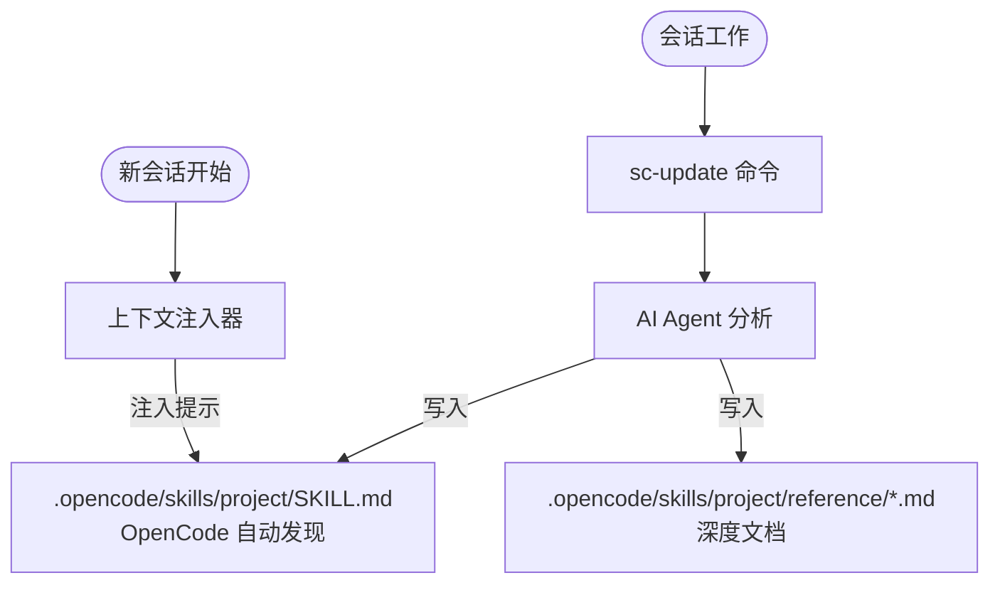

# Smart-Codebase

[English](README.md) | [简体中文](README.zh-cn.md)

> **让你的 OpenCode 在完成任务时，不断学习成长，变成你独一无二的资深项目专家。**

---

## 🔥 你的痛点

每次开始新会话时，AI 都从零开始。它不记得：
- 你为什么选择那个架构？
- 代码库中存在哪些坑？
- 你的团队遵循什么模式？
- 你从调试那个棘手的 bug 中学到了什么？

**你一遍又一遍地解释同样的事情。**

## ✨ 解决方案

Smart-Codebase 通过 SKILL 文件为你的 AI 提供永久记忆。它利用 AI Agent 自主从你的对话和项目文件中提取并沉淀知识。


```mermaid
graph TB
    Start([会话工作])
    Update[sc-update 命令]
    Agent[AI Agent 分析]
    SkillFile[.opencode/skills/project/SKILL.md<br/>OpenCode 自动发现]
    RefFiles[.opencode/skills/project/reference/*.md<br/>深度文档]
    NewSession([新会话开始])
    Injector[上下文注入器]
    
    Start --> Update
    Update --> Agent
    Agent -->|写入| SkillFile
    Agent -->|写入| RefFiles
    
    NewSession --> Injector
    Injector -->|注入提示| SkillFile
```

---

## 📖 目录

- [⚙️ 工作原理](#️-工作原理)
- [📦 安装](#-安装)
- [⚡ 命令](#-命令)
- [⚙️ 配置](#️-配置)
- [📁 文件结构](#-文件结构)
- [🛠️ 开发](#️-开发)

---

## ⚙️ 工作原理

1. **你正常工作** - 编辑文件、调试问题、做架构决策。
2. **手动触发** - 当达到某个里程碑时，运行 `/sc-update`。
3. **AI Agent 分析** - 子 AI 会话会分析你的对话记录和代码，理解发生了什么变化以及为什么。
4. **知识沉淀** - Agent 会自主编写或更新符合 OpenCode 标准格式的 SKILL 文件。
5. **下次会话开始** - 新会话会自动发现项目 SKILLs，让 AI 立即获得项目上下文。

**手动控制意味着你决定何时保存知识，而 AI Agent 则承担了编写文档的繁重工作。**

---

## 📦 安装

进入 `~/.config/opencode` 目录：

```bash
# 使用 bun
bun add smart-codebase

# 或使用 npm
npm install smart-codebase
```

添加到你的 `opencode.json`：

```json
{
  "plugin": ["smart-codebase"]
}
```

---

## ⚡ 命令

| 命令 | 描述 |
|------|------|
| `/sc-update [focus?]` | 触发 AI Agent 提取知识。可以使用可选的 focus 参数来引导 Agent。 |

---

## ⚙️ 配置

创建 `~/.config/opencode/smart-codebase.json` (或 `.jsonc`) 进行自定义配置：

```jsonc
{
  "enabled": true,
  "extractionModel": "openai/gpt-4o",
  "extractionMaxTokens": 16000
}
```

| 选项 | 默认值 | 描述 |
|------|--------|------|
| `enabled` | `true` | 完全启用或禁用插件。 |
| `extractionModel` | - | AI Agent 使用的模型 (例如 `providerID/modelID`)。 |
| `extractionMaxTokens` | `16000` | 提取上下文的最大 token 预算。 |

---

## 📁 文件结构

知识以标准 OpenCode SKILL 格式存储在项目目录中：

```
project/
└── .opencode/
    └── skills/
        └── <项目名>/
            ├── SKILL.md          # 项目主 SKILL 和索引
            └── reference/        # 详细的知识文档文件
                ├── architecture.md
                └── api-patterns.md
```

---

## 🛠️ 开发

```bash
# 安装依赖
bun install

# 构建插件
bun run build

# 运行类型检查
bun run typecheck

# 运行测试
bun test
```

---

## 📄 许可证

[Apache-2.0](LICENSE)
