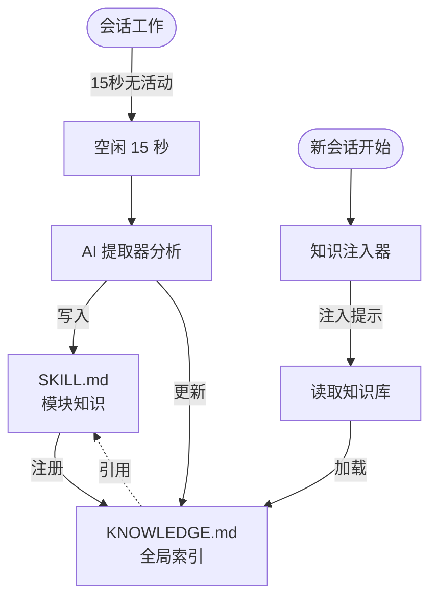

# Smart-Codebase

[English](README.md) | [简体中文](README.zh-cn.md)

> **让你的 OpenCode 在完成任务时，不断学习成长，变成你独一无二的资深项目专家。**

---

## 🔥 你的痛点

每次开始新会话时，AI 都从零开始。它不记得：
- 你为什么选择那个架构？
- 代码库中存在哪些坑？
- 你的团队遵循什么模式？
- 你从调试那个棘手的 bug 中学到了什么？

**你一遍又一遍地解释同样的事情。**

## ✨ 解决方案

smart-codebase 自动从会话中捕获知识，并使其可供未来会话使用。



---

## 📖 目录

- [⚙️ 工作原理](#️-工作原理)
- [📦 安装](#-安装)
- [🔧 命令](#-命令)
- [⚡ 配置](#-配置)
- [📁 文件结构](#-文件结构)
- [🛠️ 开发](#️-开发)

---

## ⚙️ 工作原理

1. **你正常工作** - 编辑文件、调试问题、做决策
2. **会话空闲** - 15 秒无活动后
3. **提取器分析** - 检查发生了什么变化以及为什么
4. **知识被捕获** - 存储在每个模块的 `.knowledge/SKILL.md` 中
5. **索引更新** - 全局 `.knowledge/KNOWLEDGE.md` 跟踪所有技能
6. **下次会话开始** - 首先读取 KNOWLEDGE.md，找到相关技能

**插件帮你沉淀知识，你只管鞭策 AI 写代码。**

---

## 📦 安装

进入 `~/.config/opencode` 目录：

```bash
# 使用 bun
bun add smart-codebase

# 或使用 npm
npm install smart-codebase
```

添加到你的 `opencode.json`：

```json
{
  "plugin": ["smart-codebase"]
}
```

---

## ⚡ 命令

| 命令 | 描述 |
|------|------|
| `/sc-status` | 显示知识库状态 |
| `/sc-extract` | 手动触发知识沉淀 |
| `/sc-rebuild-index` | 从所有 SKILL.md 文件重建 `.knowledge/KNOWLEDGE.md` |

---

## ⚙️ 配置

默认无须配置，如需改变默认配置，创建 `~/.config/opencode/smart-codebase.json`（或 `.jsonc`）：

```jsonc
{
  // 示例配置
  "enabled": true,
  "debounceMs": 30000,
  "autoExtract": true,
  "autoInject": true,
  "disabledCommands": ["sc-rebuild-index"]
}
```

| 选项 | 默认值 | 描述 |
|------|--------|------|
| `enabled` | `true` | 完全启用/禁用插件 |
| `debounceMs` | `15000` | 会话空闲后等待多久（毫秒）才提取 |
| `autoExtract` | `true` | 空闲时自动提取知识 |
| `autoInject` | `true` | 会话开始时注入知识提示 |
| `disabledCommands` | `[]` | 要禁用的命令，如 `["sc-rebuild-index"]` |

---

## 📁 文件结构示例

```
project/
├── .knowledge/
│   └── KNOWLEDGE.md              # 全局索引
│
├── src/
│   ├── auth/
│   │   ├── .knowledge/
│   │   │   └── SKILL.md          # 认证模块知识
│   │   ├── session.ts
│   │   └── jwt.ts
│   │
│   └── payments/
│       ├── .knowledge/
│       │   └── SKILL.md          # 支付模块知识
│       └── stripe.ts
```

---

## 🛠️ 开发

```bash
# 安装依赖
bun install

# 构建
bun run build

# 类型检查
bun run typecheck
```

---

## 📄 许可证

[Apache-2.0](LICENSE)
